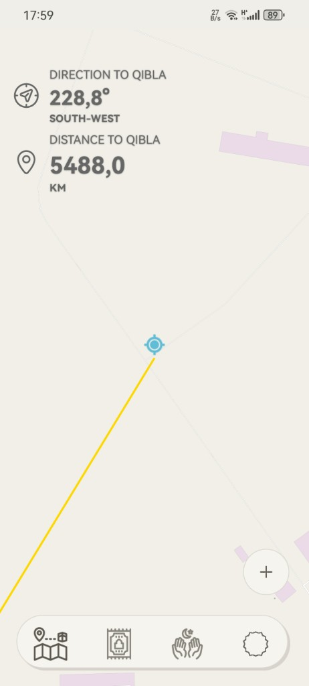
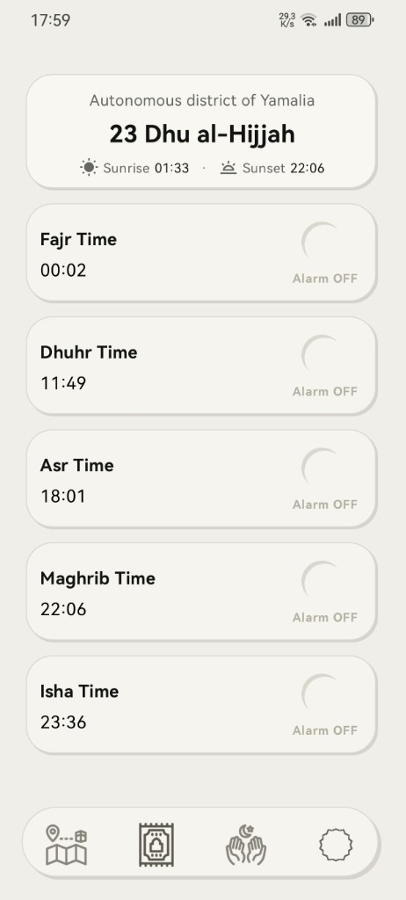
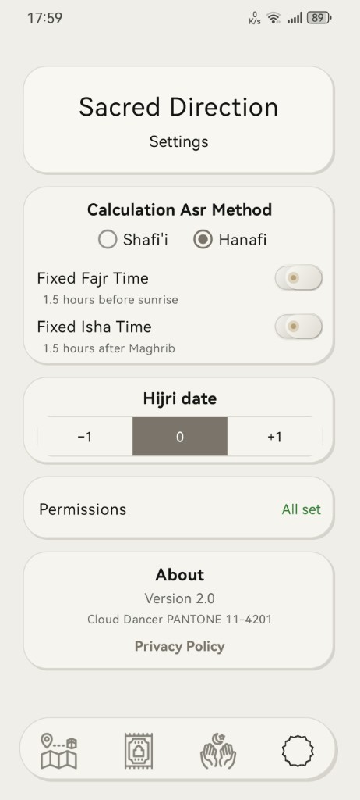

# Sacred Direction

<table>
<tr>
<td width="220" valign="middle">

</td>
<td valign="middle">

> [!IMPORTANT]
> ### Please read the Dua in the app — for us and for Palestine

</td>
</tr>
</table>

Android app for **Qibla direction**, **prayer times**, a **home-screen widget**, and **Dua** with audio.

**No magnetic compass.** Phone compasses are often inaccurate — metal and interference throw them off, and many prayer apps add one mostly for looks. Sacred Direction shows Qibla from **GPS on the map** (bearing, direction, line to the Kaaba). **Trust the map.**

Built with **Huawei AppGallery** in mind: many devices ship **without Google Play Services**, so Google Maps is not a reliable baseline. The map uses **OpenStreetMap** via OSMDroid instead — it works on Huawei/Honor and worldwide without a Google account or proprietary map SDK.

Available on [Huawei AppGallery](https://developer.huawei.com/consumer/en/service/josp/agc/index.html) (package: `com.example.qiblaapp2`).

## Screenshots

| Map & Qibla | Prayer times |
|:---:|:---:|
|  |  |

| Dua | Settings |
|:---:|:---:|
|  |  |

## Features

- **Map & Qibla** — GPS bearing, direction name, line to the Kaaba on the map (OSMDroid; no magnetometer compass)
- **Prayer times** — Fajr, Dhuhr, Asr, Maghrib, Isha; optional adhan alarms; compact header card with city, date, sunrise & sunset on one line
- **Hijri date** — Umm al-Qura calendar; tap date on Prayer tab to switch Gregorian / Hijri; Settings adjustment ±1 day to match local mosque
- **Widget** — prayer times on the home screen (updates after reboot)
- **Dua** — Bismillah, Arabic text, translation, and audio playback
- **Settings** — Asr method, fixed Fajr/Isha, Hijri offset, permissions, About, Privacy Policy

## Why OpenStreetMap (not Google Maps)

- **Huawei / no GMS** — Google Maps SDK expects Google Play services; OSM tiles load over HTTPS like a normal web map.
- **Store builds** — default is **OSM Mapnik** only; no Google API key, no satellite licensing surprises for reviewers.
- **Qibla use case** — you need position, bearing, and a line to the Kaaba; street-level OSM detail is enough; fancy satellite imagery is optional, not required.

**Tiles:** OSM Mapnik only — no third-party map API keys in release builds.

## Tech stack

- Kotlin, XML layouts (no Compose)
- [OSMDroid](https://github.com/osmdroid/osmdroid) + OpenStreetMap Mapnik
- [PrayTimes](http://www.praytimes.org) (via `PrayerTimesCalculator`)
- ICU `IslamicCalendar` (Umm al-Qura) for Hijri dates
- `TimezoneMapper` for local timezone from coordinates
- minSdk 24, targetSdk 34

## Project structure

```
app/src/main/java/com/example/qiblaapp2/
  MainActivity.kt              — map / Qibla
  PrayerTimesActivity.kt       — prayer times & alarms
  DuaActivity.kt               — Dua screen
  SettingsActivity.kt          — app settings
  HijriPrefs.kt                — Hijri date & offset
  MapTileSources.kt            — OSM Mapnik tile source
  TabUiHelper.kt               — bottom nav highlight
  NeumorphicSwitchView.kt      — custom switches in Settings
  PrayerTimesWidgetProvider.kt — home screen widget
tools/nav-icons-svg/           — build script for tab PNG icons
```

## Build

1. Open the project in **Android Studio**
2. Copy `local.properties` (SDK path only)
3. Sync Gradle
4. Run **debug** on a device, or **Generate Signed APK** for release

Release signing keystore is **not** included in this repository. Keep your `.jks` file local and never commit it.

Current version: **2.0.2** (`versionCode` 8)

## Changelog

### 2.0.2 (versionCode 8)

- **Fix OpenStreetMap tile loading (User-Agent block)** — set unique User-Agent compliant with OSM Tile Usage Policy to prevent 403 tile load errors.

**AppGallery / release notes (copy-paste):** `Fix map tile loading (OpenStreetMap User-Agent policy compliance).`

### 2.0.1 (versionCode 7)

- **Fix Fajr at high latitude** — with *Fixed Fajr* (1.5 h before sunrise) enabled, Fajr now uses the same NOAA sunrise shown in the app and wraps correctly past midnight (e.g. sunrise 01:30 → Fajr 00:00, not 22:59). Affects northern regions with early summer dawn (Yamal, Murmansk, etc.).

**AppGallery / release notes (copy-paste):** `Fix Fajr at high latitude when Fixed Fajr is enabled in Settings.`

### 2.0 (versionCode 6)

- Neumorphic UI, privacy policy update, Huawei listing alignment (no compass).

## Privacy

Privacy policy (in-app and online): [telegra.ph/Privacy-Policy-09-18-69](https://telegra.ph/Privacy-Policy-09-18-69)

Contact: solemetra@gmail.com

## License

Copyright (c) Solemetra. See [LICENSE](LICENSE).

You may fork and build on this code if you **keep attribution**:

- In the **repo** (README): link to [github.com/solemetra/SacredDirection](https://github.com/solemetra/SacredDirection)
- In a **published app** (About or similar): *Based on Sacred Direction* + the same link

Use your own app name, package id, and signing key for store listings.
